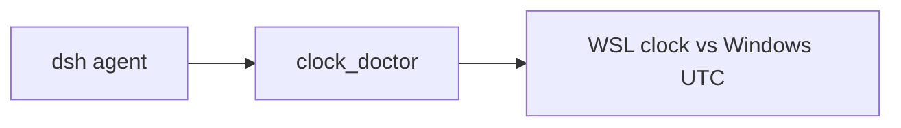

# dsh-wsl-clock
> **kit:** [dsh-wsl-kit](https://github.com/173787247/dsh-wsl-kit)

## Compatibility

| Field | Value |
|-------|-------|
| **Plugin** | `dsh-wsl-clock` **0.2.0** |
| **Minimum dsh** | ≥ **0.1.2** (web UI one-shot `?token=` on Windows relay `:3081`) |
| **Latest verified** | See [dsh-wsl-kit Compatibility](https://github.com/173787247/dsh-wsl-kit#compatibility-2026-09) (currently **`0.1.5-rc.1`**) — single source of truth for the suite |
| **Kit set** | `llm` / `full` (some also useful alone) |
| **Cloud Flash** | Use model id **`deepseek-flash`** (V4.1 Flash) in `~/.dsh/settings.yaml` / `llm-deepseek` — not configured by this plugin |
| **Agent Teams** | Upstream experimental; not required here |

Suite floor versions: kit [`check-plugin-versions.sh`](https://github.com/173787247/dsh-wsl-kit/blob/master/scripts/check-plugin-versions.sh). Fault tree: [TROUBLESHOOTING.md](https://github.com/173787247/dsh-wsl-kit/blob/master/docs/TROUBLESHOOTING.md).

**`clock_doctor`**: WSL vs Windows UTC skew (ok/warn/fail). Large skew breaks TLS and GitHub App JWTs after sleep.

```sh
dsh plugin --profile web add github:173787247/dsh-wsl-clock
npm test
```

MIT

## Where it sits

Compares WSL and Windows UTC so TLS and GitHub App JWTs are not failing on skew.



Suite diagram and version snapshot: [dsh-wsl-kit](https://github.com/173787247/dsh-wsl-kit#how-the-pieces-fit). This plugin is **0.2.0** (full; also in llm). Do not copy that matrix into this README.

